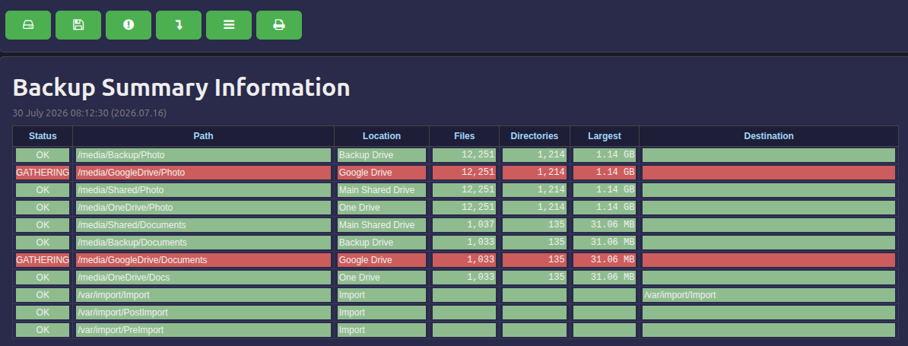
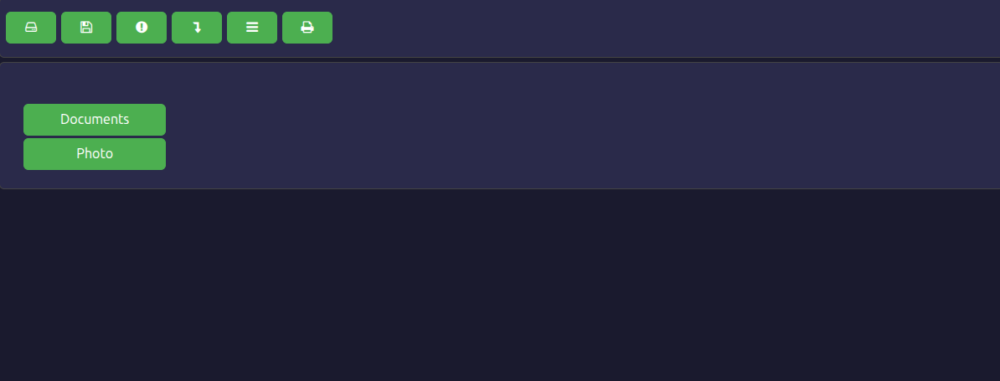
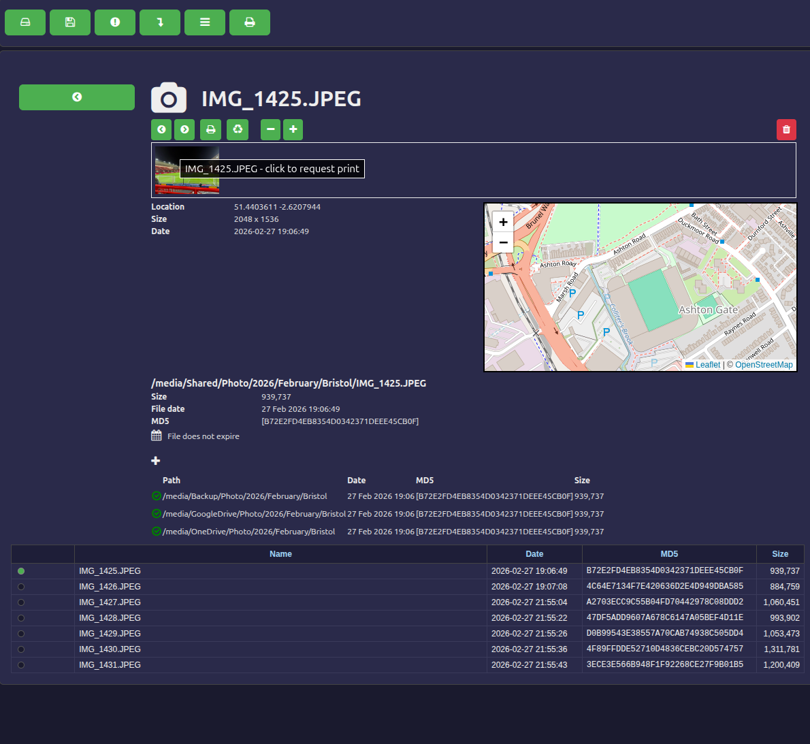
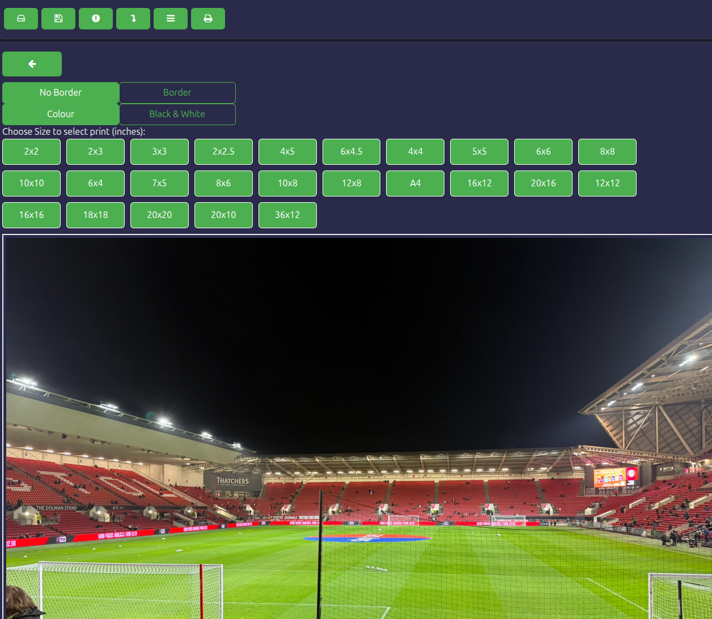
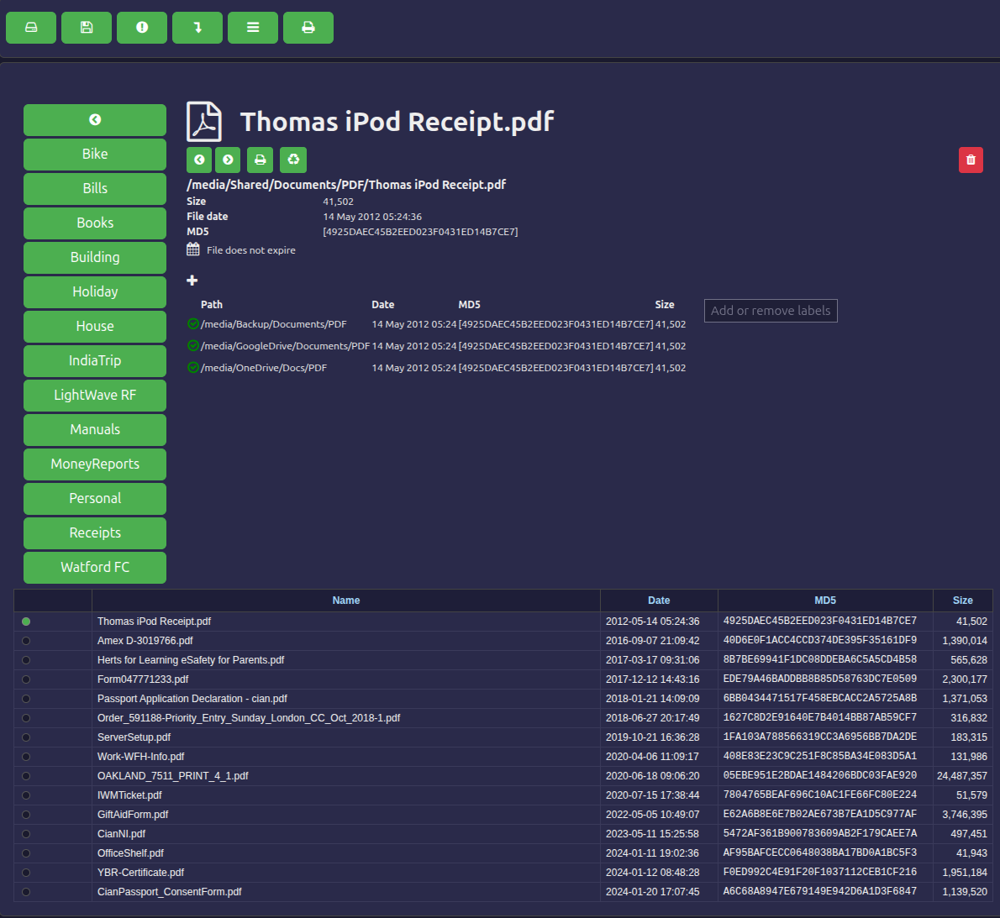
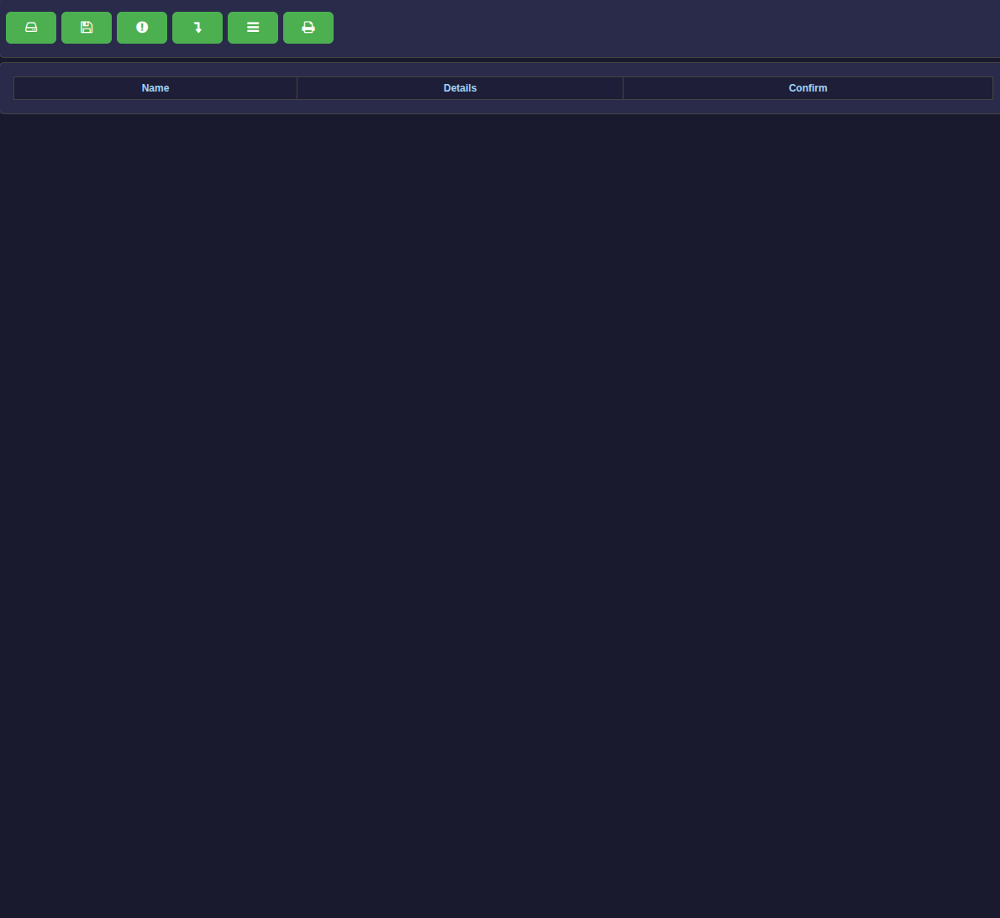
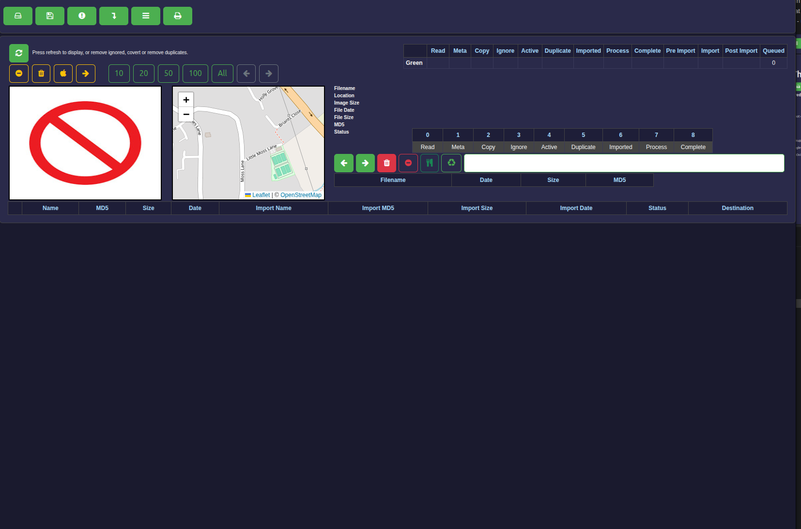
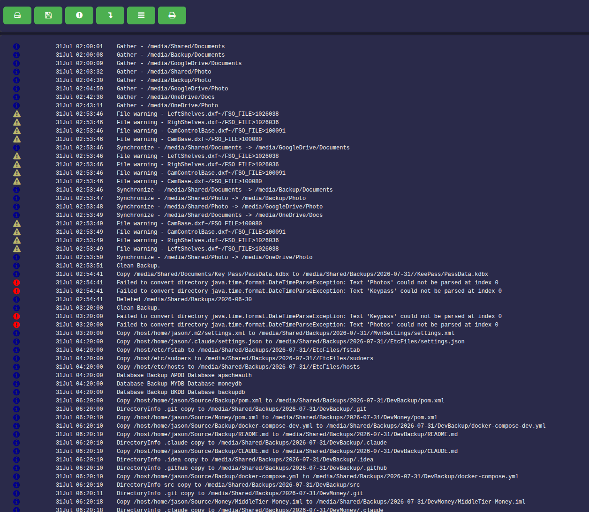
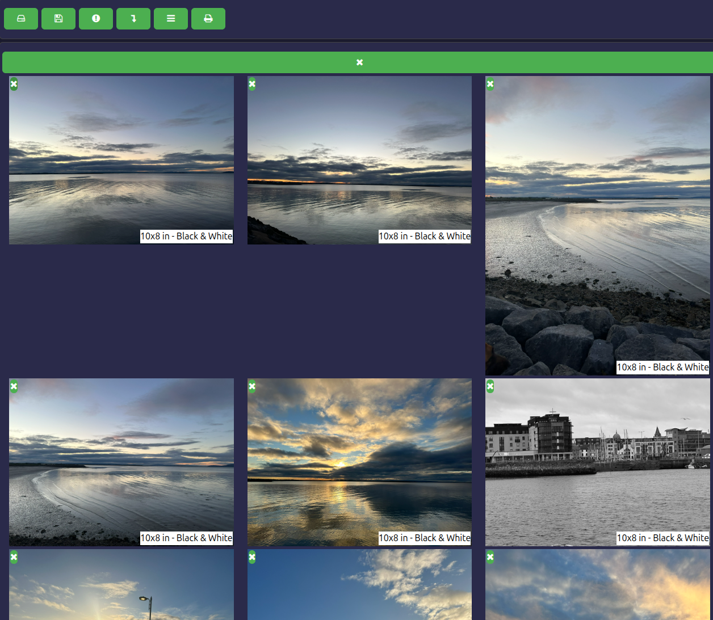

# JBR-693 - Backup UI Improvements

## Backup Component

The backup component performs two jobs;

+ Run a set of specific backup type tasks that are defined in a database, for example backup database or backup specific files to a NAS drive.
+ Copy specific files from a NAS drive to a backup NAS drive, Google Drive and One Drive.  Details of the files are stored in a database, for photo and video type files the meta data is extracted and stored in the database. 

## Current UI

The current UI contains 6 tabs that provide the following:

+ Summary information - shows file counts and the status of copying.
+ View files - a tree view that allows the user to view details of files and thier backups.
+ Actions to approve - in order to prevent unwanted damage to the files, things like deletes need to be approved - this screen shows those actions and allows the user to approve.
+ Import - this is used to import photo files, the system will process the files for import, prevent duplicates, allow files to be ignored, gather meta data and copy file to a specific directory based on date time.
+ Log - view logs from the server.
+ Print - select photos for printing - this view shows what photos have been selected for print and details of the print required.

### Summary information tab

Simply displays the summary data as a list, if status is not OK then highlighted.

### View Files tab

Initial view shows the high level directories, currently Documents and Photo

The photo or video view shows a number of details of the photo/video:

+ Location - shows lat long and a map.
+ Files Size
+ Date
+ MD5 checksum
+ Backups of this file
+ There is a list of the files in the same directory, which can be selected for main display.
+ Photo is displayed small at the beginning and can be increased.
+ An expiry date for the file - used to indicate when a file may be out of date.

If the user clicks on the photo they can specify details of a print - these are sent of to an online retailer for printing.

If file is not a photo / video - then display is basically the same but no view of the file is shown.

### Actions to approve

This is just a list of actions with a confirm button.

### Import

Controls the import of photos and videos, displays the media and information such as location and size.  A number of steps are involved in the processing and the status is show - it updates as files are updated.  User can choose the directory name, system will then put in that directory below the dated directory.  User can ignore files so they are never imported.

### Logs

Displays a list of log file entries from the server.

### Prints

Displays the photos selected for print with the size requested, user can remove from prints.

## UI improvements

### Overview

The goal is to make the backup UI more professional in appearance and easier to use, without fundamentally changing the information shown or the user workflow. Improvements fall into two categories: cross-cutting (navigation, visual polish) and per-tab changes.

---

### Navigation bar

**Current state:** Six icon-only buttons, all styled identically in green. No labels. No visible active state. The user must already know what each icon means.

**Changes:**

- Replace the button row with a proper tab bar. Each tab has an icon above (or beside) a text label:
  - Summary (fa-hdd-o)
  - Files (fa-folder-open)
  - Actions (fa-exclamation-circle)
  - Import (fa-level-down)
  - Logs (fa-file-text)
  - Prints (fa-print)
- The **active tab** is visually distinct — white or light background, darker text, no border-bottom — so the user always knows where they are.
- Inactive tabs are muted (e.g. grey text on the dark background) rather than all-green.
- The **Actions tab** shows a **badge count** of pending actions when the count is greater than zero (e.g. a small red circle with a number). This is a key safety signal — the user needs to notice there are things to approve without having to click into that tab.
  - The badge count is fetched lazily via the existing actions service on component init. A dedicated backend endpoint (`/actions/count`) should be added later (stage 7 backend work) to make this more efficient; for now the full action list response is used to derive the count.

---

### Summary tab

**Current state:** A flat table with one row per source×location combination. All rows are fully coloured green or red, making GATHERING (which is a working state, not an error) look as alarming as a real failure.

**Changes:**

- **Group rows by path type** with a visual section separator. The sources naturally fall into groups (Photo backups, Document backups, Import paths). Add a subtle group header row between them to break up the visual noise.
- **GATHERING status**: change from a fully red row to a neutral/amber row with a small spinner in the Status cell and the text "In progress". Reserve red rows for genuine error states.
- **File count comparison**: where multiple rows share the same logical path (e.g. Photo on Shared Drive, Backup Drive, Google Drive, One Drive), show a comparison indicator in the Files column. If all counts match, show a tick. If they diverge, highlight the differing value. This makes sync state obvious at a glance rather than requiring the user to read all four numbers.
- **Refresh button**: add a single refresh button (fa-refresh) somewhere in the summary header area to re-fetch the summary data on demand.
- The **Destination column** is mostly empty for most rows — consider making it conditional (only show the column when at least one row has a destination) or replacing it with the comparison indicator above.

---

### View Files tab

**Current state:** Left panel is a column of plain green buttons for navigation. Bottom area is a plain table of file names/dates. File detail stacks map, image, metadata, and backup list vertically. When at the top level only two buttons (Documents, Photo) are visible in a large empty space.

**Changes:**

- **Breadcrumb navigation** at the top of the left panel showing the current path (e.g. Photo › 2024 › February). Each segment is clickable to jump up to that level. This replaces the need for the back button (←) and makes the hierarchy clear.
- **Thumbnail grid** for the file list. When the current directory contains image or video files, display them as a grid of thumbnails rather than a plain table. Selecting a thumbnail loads it in the detail panel as now. For directories, keep the current button-list style for navigation. For non-image files (Documents), retain the table-style list.
  - Thumbnail size: fixed at 150×100px with filename truncated below.
  - The currently selected file is highlighted with a border.
- **Detail panel layout**: the right-hand detail panel already works well; keep the structure but tighten the vertical spacing. The map, image/video, metadata and backup list sections can stay as stacked sections.
- **Top-level state**: at the top level (Documents / Photo), display the two category buttons as larger, card-style tiles rather than narrow green buttons in an otherwise empty screen.

---

### Actions tab

**Current state:** Empty table with column headers when there are no pending actions. No feedback that the state is actually clean.

**Changes:**

- **Empty state**: when the actions list is empty, replace the blank table with a clear message: "No pending actions — everything is up to date" with an appropriate icon (e.g. fa-check-circle). This is reassuring and removes ambiguity about whether data has loaded.
- **"Confirm all" button**: when actions are present, add a "Confirm all" button at the top of the table. Because this is a potentially destructive batch operation, it must show a confirmation dialog before proceeding.
- **Action type display**: the action type (delete, move, etc.) should be shown as a small colour-coded badge/chip in the Details column rather than plain text, to make different action types scannable at a glance.
- The media preview (shown when a file is selected) can stay as-is; it is already useful.

---

### Import tab

**Current state:** The layout is intentionally complex (a power-user workflow tool). It is functional but visually cluttered — controls, step indicators, file preview, map, and a wide grid are all competing for attention.

**Changes (visual polish, not workflow simplification):**

- **Section separation**: use clear visual dividers or card containers to separate the three distinct areas: (1) the control/summary bar at the top, (2) the selected-file preview panel, (3) the file grid. Currently these areas blur together.
- **Column headers**: the grid has duplicate column names (Name, MD5, Size, Date appear twice — once for source, once for import). Add a clear two-level header: a top row with "Source" spanning the first four columns and "Import" spanning the next four, so the user immediately understands the two sides.
- **Step progress indicator**: the 0–8 traffic light steps are clever but opaque. Add a tooltip or small label on each step cell so hovering reveals what step 3, step 5 etc. represent (Read, Meta, Copy, Ignore, Active, Duplicate, Imported, Process, Complete). The colours can stay as-is.
- **Button bar**: the control buttons (refresh, remove confirmed, remove ignored, etc.) should be grouped with a small label or tooltip on each. Currently they are plain icons with no indication of what they do.

---

### Logs tab

**Current state:** A dense wall of all log entries from the server. All entries are the same size and style; only a small icon distinguishes the level. No filtering. Hard to scan for problems.

**Changes:**

- **Level filter buttons**: add a row of toggle buttons at the top — Debug, Info, Warning, Error — each pre-selected. Toggling a button off hides all rows of that level instantly (client-side filter, no server round-trip). This is the single biggest usability improvement for this tab.
- **Row colour tinting by level**: apply a subtle background tint to rows based on level — no tint for Debug/Info, light amber for Warning, light red for Error. The icon alone is too small to scan. Combined with the filter buttons this makes errors immediately visible.
- **Timestamp format**: change `ddMMM HH:mm:ss` to `dd MMM HH:mm:ss` (add space for readability). Consider adding the year when log entries span multiple days.
- **Backend**: ideally the log endpoint supports a `level` query parameter for server-side filtering, but client-side filtering is sufficient for reasonable log volumes.

---

### Prints tab

**Current state:** A grid of selected print photos with size labels. A single "clear all" button (X icon) at the top left. Already the cleanest tab.

**Changes:**

- **Total count**: show a small summary at the top ("9 photos selected") so the user knows how many are in the basket without counting.
- **Clear all confirmation**: the clear-all button (fa-close) currently executes immediately with no confirmation. Since this discards all selected prints, add a confirmation dialog ("Clear all 9 photos from print selection?").
- **Remove button placement**: the per-photo remove button (×) on each image card could be made more visible — currently it is small and positioned inconsistently. Move it to a consistent corner (top-right) with slightly larger hit area.

---

### Backend changes required

| Change | Required for |
| --------------------------------- | --------------------------------------------------- |
| `/actions/count` endpoint         | Efficient action badge (lazy-load fallback for now) |
| Log level filter parameter        | Optional — client-side filtering is initial approach |

---

### Implementation stages

Implementation is split into stages so each can be reviewed before the next begins. Each stage is self-contained within one component subtree.

#### Stage 1 — Navigation bar ✅ Complete
**Files:** `backup-list.component.html`, `backup-list.component.css`, `backup-list.component.ts`

- Replace icon-only button row with a proper tab bar with icon + text label per tab
- Active tab visually distinct (lighter background, darker text)
- Inactive tabs muted rather than all-green
- Actions tab shows a badge count fetched lazily from the actions service on init

#### Stage 2 — Summary tab ✅ Complete
**Files:** `backup-summary.component.html/.css`, `backup-summary-grid.html`, status/path data cell components

- Group rows by path type with a visual section separator
- GATHERING status: amber row + spinner instead of full red row
- File count comparison indicator (tick when all copies match, highlight divergence)
- Refresh button in the summary header
- Conditionally hide the Destination column when all values are empty

#### Stage 3 — Actions tab ✅ Complete
**Files:** `backup-action.component.html/.css/.ts`

- Empty state message when no actions are pending
- "Confirm all" button with confirmation dialog
- Action type shown as colour-coded badge/chip rather than plain text

#### Stage 4 — Logs tab ✅ Complete
**Files:** `backup-log.component.html/.css/.ts`

- Level filter toggle buttons (Debug / Info / Warning / Error) — client-side, no server round-trip
- Row background tint by level (amber for Warning, light red for Error)
- Improved timestamp format

#### Stage 5 — View Files tab ✅ Complete
**Files:** `backup-display.component.html/.css/.ts`, `backup-display-files.*`, new thumbnail grid component

- Breadcrumb navigation replacing the back button in the left panel
- Thumbnail grid (150×100px fixed) for image/video directories; table list retained for non-image files
- Card-style tiles for top-level (Documents / Photo) entry points

#### Stage 6 — Import tab ✅ Complete
**Files:** `import-grid.html/.css`, header components

- Visual dividers between control bar, preview panel, and file grid
- Two-level column headers (Source | Import) above the duplicated columns
- Tooltips/labels on the step progress indicator
- Tooltips on the control button bar

#### Stage 7 — Prints tab + backend action count ✅ Complete
**Files:** `backup-prints.component.html/.css/.ts`; backend `/actions/count` endpoint

- Total selected count shown at the top
- Confirmation dialog on "clear all"
- Consistent per-photo remove button placement (top-right corner)
- Backend: add `/actions/count` endpoint and wire up the stage 1 badge to use it